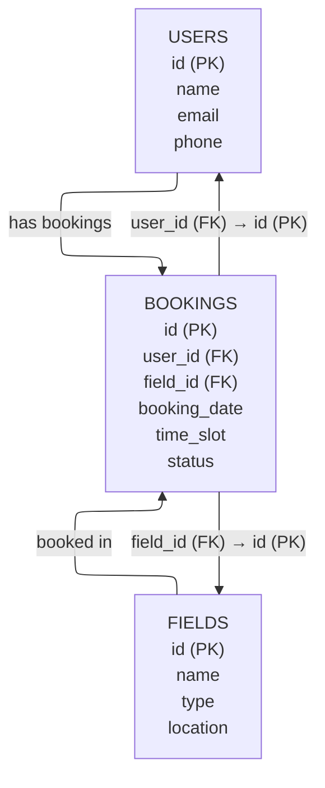

# Tugas Praktikum 7 DPBO C2

## Janji
Saya Rahmat taufik dengan NIM 2300414 mengerjakan soal TP8 dalam mata kuliah Desain Pemograman Berorientasi Objek untuk keberkahanNya maka saya tidak melakukan kecurangan seperti yang telah dispesifikasikan. Aamiin.

## Tujuan Sistem
Aplikasi web ini digunakan untuk mengelola data pengguna, lapangan olahraga, dan pemesanan (booking) jadwal penggunaan lapangan secara terstruktur dan mudah.

## Struktur Direktori Proyek
```
/ (root)
|-- assets/           # File statis (CSS, JS, gambar)
|-- class/            # Class OOP (User, Field, Booking)
|-- config/           # Konfigurasi database (db.php)
|-- database/         # File SQL (db_booking.sql)
|-- view/             # File modular tampilan (header, footer, dsb)
|-- index.php         # Entry point utama aplikasi
|-- README.md         # Dokumentasi proyek
```

## Penjelasan Tabel dan Relasi
- **users**: Data pengguna (id, name, email, phone)
- **fields**: Data lapangan (id, name, type, location)
- **bookings**: Data pemesanan (id, user_id, field_id, booking_date, time_slot, status)
  - Relasi: `bookings.user_id` → `users.id`, `bookings.field_id` → `fields.id`

## Diagram Relasi Database



## Cara Instalasi & Menjalankan di Localhost (XAMPP)
1. Clone/copy seluruh folder ke `htdocs` (misal: `C:/xampp/htdocs/TP8DPBOC12025`)
2. Buat database MySQL baru dengan nama `booking_lapangan`
3. Import file `database/db_booking.sql` ke database tersebut via phpMyAdmin
4. Pastikan konfigurasi database di `config/db.php` sudah sesuai (user: root, tanpa password, atau sesuaikan dengan XAMPP Anda)
5. Jalankan XAMPP (Apache & MySQL), lalu akses di browser: `http://localhost/TP8DPBOC12025/`

## Fitur Utama
- CRUD data Users, Fields, Bookings
- Pencarian booking berdasarkan nama user/lapangan
- Tampilan responsif Bootstrap
- Navigasi, tabel data, form tambah/edit, tombol aksi, alert feedback

## Screenshot Antarmuka
<video src="https://github.com/user-attachments/assets/9965f3ca-3bdc-4fc3-9f01-a1a249ccd59c" controls width="600">
Your browser does not support the video tag.
</video>
